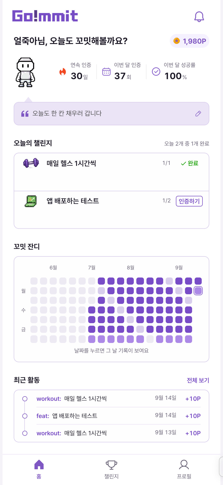
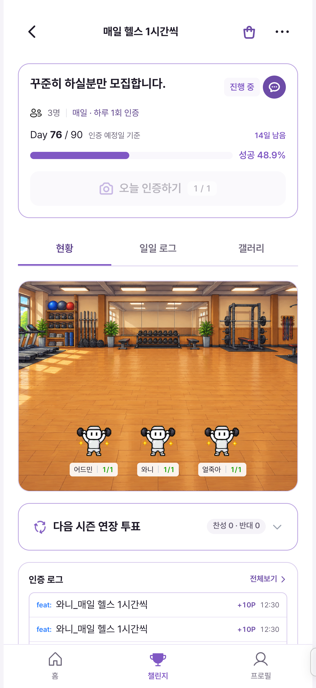
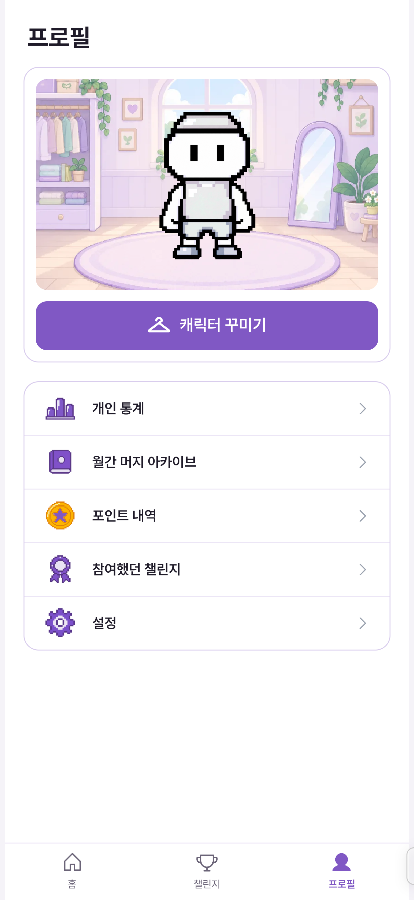
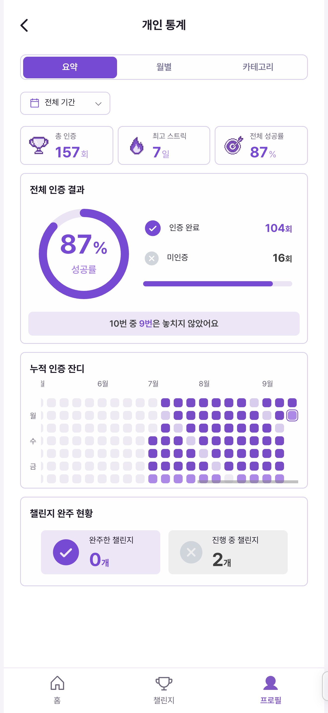
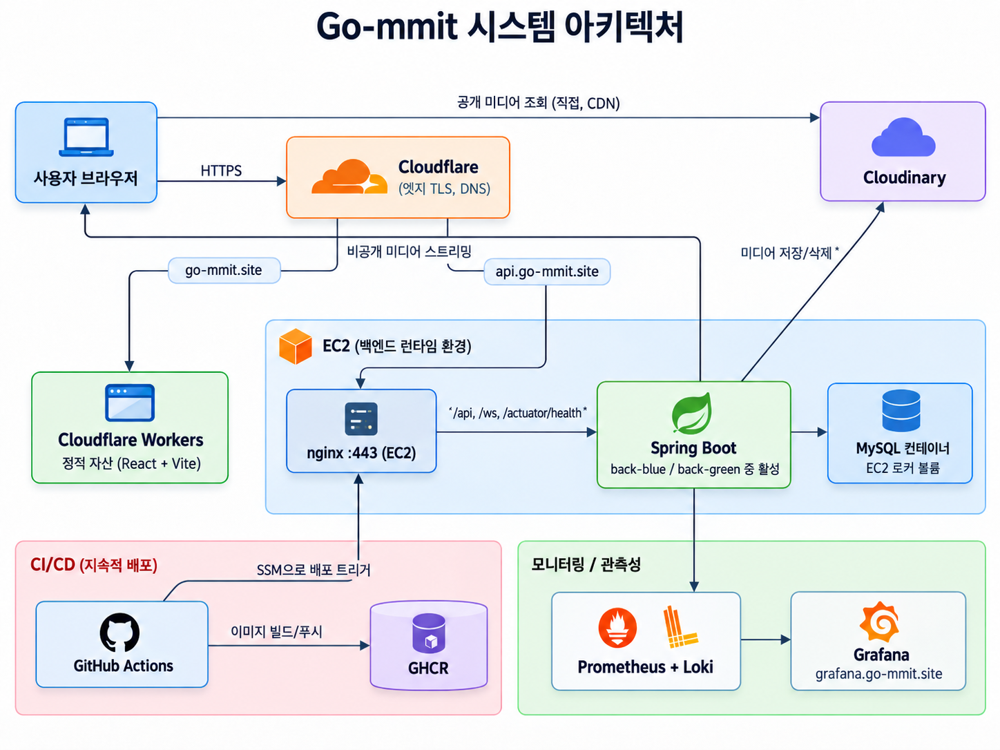

# 꼬밋 (Go!mmit)

1~6명의 소규모 그룹이 매일 사진·영상으로 서로 인증하며 습관을 함께 끌고 가는 챌린지 서비스입니다.

인증은 미리 찍어둔 파일이 아닌 그 자리에서 촬영한 짧은 클립으로만 가능하고, 쌓인 포인트로 캐릭터와 그룹 공간을 꾸밀 수 있습니다. 한 달이 지나면 월간 머지, 챌린지가 끝나면 최종 머지가 영수증처럼 발행되어
노력의 흔적이 기록으로 남습니다.

[](https://github.com/prgrms-be-devcourse/NBE10-12-final-ildangback/actions/workflows/backend-ci.yml)
[](https://github.com/prgrms-be-devcourse/NBE10-12-final-ildangback/actions/workflows/frontend-ci.yml)

**배포 링크**: https://go-mmit.site<br>
**프로젝트 기간**: 2026-08-20 ~ 2026-09-15

---

## 목차

- [주요 화면](#주요-화면)
- [시작하기](#시작하기)
- [코드 스타일](#코드-스타일)
- [핵심 기능](#핵심-기능)
- [기술 스택](#기술-스택)
- [프로젝트 구조](#프로젝트-구조)
- [아키텍처](#아키텍처)
- [협업 방식](#협업-방식)
- [팀원](#팀원)

---

## 주요 화면

<p align="center">
  
  
  
  
</p>

---

## 시작하기

### 요구 사항

| 대상 | 버전 |
|-----|-----|
| JDK | 25 |
| Node.js | 24 이상 |
| pnpm | 11.24.0 |
| Docker | 테스트 실행 시 필요 |

프론트엔드는 pnpm 만 허용합니다. npm 이나 yarn 으로 설치하면 `preinstall` 단계에서 막힙니다.

로컬 개발 환경은 **H2 파일 기반 데이터베이스**를 사용합니다. 별도 설정이 필요 없습니다.

아래 명령은 모두 **프로젝트 루트에서** 실행합니다. 각 명령은 서브셸에서 돌아가므로 실행 후 루트로 돌아옵니다.

### 1. 백엔드 실행

```bash
(cd back && ./gradlew bootRun)
```

### 2. 프론트엔드 실행

```bash
(cd front && pnpm install && pnpm dev)
```

### 환경변수 (선택)

백엔드 주소와 소셜 로그인 클라이언트 ID 는 `front/.env.example` 을 복사해 설정합니다.
기본값으로도 로컬 실행에는 문제가 없고, 구글과 네이버 로그인을 쓸 때만 값이 필요합니다.

```bash
(cd front && cp .env.example .env.local)
```

### 이메일 인증 확인 (로컬)

로컬에서는 메일을 보내지 않고 인증 링크를 콘솔에 찍습니다.

```
[인증 링크] user@example.com -> http://localhost:8080/api/auth/verify-email?token=...
```

이 주소를 브라우저에서 열면 인증이 완료됩니다.

### 엔드포인트

| 서비스              | URL                                   |
|------------------|---------------------------------------|
| 프론트엔드            | http://localhost:5173                 |
| API 문서 (Swagger) | http://localhost:8080/swagger-ui.html |
| H2 콘솔            | http://localhost:8080/h2-console      |

배포 환경에서는 `/swagger-ui`를 외부에 열지 않습니다. 실사용자에게 서비스되는 프로덕션이라 전체 API 명세와 관리자 엔드포인트(`/api/admin/**`)까지 그대로 공개하지 않으려는 의도적인 선택입니다. nginx가 `/api`, `/ws`, `/actuator/health`만 백엔드로 프록시하고 나머지 경로는 404로 막습니다. API 문서는 로컬에서 실행한 뒤 위 Swagger 주소로 확인합니다.

### 테스트

통합 테스트가 Testcontainers 로 MySQL 8 컨테이너를 띄우므로 **도커가 실행 중이어야 합니다.**

```bash
(cd back && ./gradlew test)
```

CI와 동일하게 Checkstyle·커버리지 검증까지 포함하려면:

```bash
(cd back && ./gradlew check)
```

커버리지 리포트는 `back/build/reports/jacoco/test/html/index.html`에 생성됩니다.
프론트엔드 테스트는 아직 설정되어 있지 않습니다.

---

## 코드 스타일

커밋 전에 실행하면 고칠 수 있는 위반은 자동으로 수정됩니다.

```bash
(cd back && ./gradlew spotlessApply)
```

```bash
(cd front && pnpm format && pnpm lint:fix)
```

수정 없이 확인만 하려면 (CI와 동일한 검사):

```bash
(cd back && ./gradlew spotlessCheck checkstyleMain)
```

```bash
(cd front && pnpm format:check && pnpm lint)
```

Checkstyle은 자동 수정 기능이 없어 네이밍·복잡도 같은 위반은 직접 고쳐야 합니다.

| 대상        | 도구                                   | 설정 파일                                   |
|-----------|--------------------------------------|-----------------------------------------|
| 백엔드 포맷    | Spotless + Google Java Format (AOSP) | `back/build.gradle`                     |
| 백엔드 정적 분석 | Checkstyle                           | `back/config/checkstyle/checkstyle.xml` |
| 프론트엔드 린트  | ESLint                               | `front/eslint.config.js`                |
| 프론트엔드 포맷  | Prettier                             | `front/.prettierrc`                     |
| 에디터 공통    | EditorConfig                         | `.editorconfig`                         |

> CI에서 머지를 막는 검사는 **백엔드 테스트(`./gradlew check`)와 프론트엔드 빌드(`pnpm build`)** 입니다.
> 포맷·린트 검사는 `continue-on-error`로 실행되어 PR에 리포트 코멘트만 남기고 머지를 막지 않습니다.

---

## 핵심 기능

| 기능                | 설명                                    |
|-------------------|---------------------------------------|
| **회원가입 & 로그인**    | 이메일 인증, 비밀번호 재설정, 구글/네이버 소셜 로그인       |
| **챌린지 생성 & 참여**   | 개인 또는 그룹 챌린지 생성, 초대 코드 기반 참여          |
| **실시간 인증 (Check-in)** | 그 자리에서 촬영한 영상/사진으로만 인증 가능             |
| **내 인증 모아보기**     | 개인 인증 기록을 갤러리로 조회                     |
| **일일로그**          | 그룹, 날짜별 인증을 타일 영상으로 자동 컴필레이션          |
| **월간 머지 & 최종 머지** | 챌린지 결과를 영수증처럼 발행, 개인 아카이브 조회          |
| **개인 통계**         | 참여 챌린지 수, 완료일수, 최장 연속, 평균 완주율, 월별/카테고리별 집계 |
| **포인트 & 정산**      | 인증 시 포인트 지급, 개인/그룹 잔액과 변동 이력 조회       |
| **캐릭터 & 아이템 상점**  | 포인트로 아이템 구매, 캐릭터 커스터마이징               |
| **그룹 배경 상점**      | 그룹 포인트로 배경 구매, 멤버 투표로 적용 결정           |
| **그룹 채팅**         | STOMP 기반 실시간 그룹 채팅                     |
| **알림**            | 콕 찌르기 등 실시간 알림                         |
| **신고 및 이의제기**     | 인증 신고, 이의제기, 관리자 심사와 제재               |
| **홈 대시보드**        | 참여 챌린지, 최근 활동 요약                      |
| **관리자 페이지**       | 아이템/배경 등록과 삭제, 신고 심사                  |
| **스케줄러 기반 정산**    | 매일 새벽 4시 자동 정산 (포인트 지급, 스트릭 계산)       |

---

## 기술 스택

**Backend**


-010101)

**Frontend**


**Mobile**


**Database**


**Media**


**Infrastructure**


**Monitoring**


**Quality & Docs**


---

## 프로젝트 구조

```
.
├── back/     Spring Boot 백엔드
│   └── src/main/java/com/gommit/
│       ├── domain/   도메인별 패키지 (user, challenge, group, checkin, point, record, item 등)
│       └── global/   공통 설정, 예외, 시큐리티, 응답 DTO
├── front/    React + TypeScript + Vite
│   └── src/domains/  도메인별 화면과 API 호출
├── app/      안드로이드 웹뷰 셸 (Kotlin Multiplatform)
├── infra/    Terraform, Docker Compose, nginx, 모니터링 설정
├── docs/     ERD, 아키텍처 다이어그램, 테이블 명세
└── .github/  CI, 배포, 코드 리뷰 워크플로
```

---

## 아키텍처

프론트는 Cloudflare Workers에 정적 자산으로 배포되고, 백엔드/DB/모니터링은 EC2 한 대 위에서 Docker Compose로 함께 돕니다. nginx는 `/api`, `/ws`, `/actuator/health`만 백엔드로 프록시하고 나머지는 막습니다. 배포는 GitHub Actions가 이미지를 빌드해 GHCR에 올리고, EC2에서 blue/green 컨테이너를 번갈아 띄워 무중단으로 전환합니다.



VPC, EC2, IAM, DNS 는 Terraform 으로 관리합니다(`infra/terraform/`).
설계 결정 근거는 [`infra/docs/infra-design.md`](infra/docs/infra-design.md), 최초 배포와 롤백, DB 백업 절차는 [`infra/docs/infra-runbook.md`](infra/docs/infra-runbook.md)에 있습니다.

### ERD


테이블별 컬럼, 제약조건, 인덱스 설명은 [`docs/테이블명세.md`](docs/테이블명세.md)에 있습니다.

---

## 협업 방식

브랜치는 `feat/<이슈번호>-<슬러그>` 형식으로 파고, `main`/`dev`에는 직접 push하지 않고 이슈 기반 PR로 병합합니다. PR은 본인 외 2명의 승인을 받아야 머지할 수 있습니다. 커밋 메시지는 `타입: 설명`(`feat`, `fix`, `chore`, `docs`) 형식을 따릅니다. PR이 열리면 GitHub Actions 기반 AI 코드 리뷰가 자동으로 붙어 필수 수정(P1)과 권장 수정(P2)으로 나눠 코멘트를 남깁니다.

---

## 팀원

| 이름  | 역할 | 담당 도메인                                                | GitHub                                                                                                                    |
|-----|----|-------------------------------------------------------|----------------------------------------------------------------------------------------------------------------------------|
| 오준서 | 팀장 | 사용자(User), 그룹 채팅(Chat), 그룹 상점(Group Shop), 신고(Report) | [](https://github.com/piker0925)         |
| 황보람 | 팀원 | 그룹(Group), 챌린지(Challenge), 알림(Notification)           | [](https://github.com/Boram-Hwang)       |
| 남효림 | 팀원 | 인증(Check-in), 미디어(Media), 인프라                         | [](https://github.com/EuniceNam)         |
| 한철완 | 팀원 | 포인트(Point), 결과·기록(Record)                             | [](https://github.com/Mungwani)          |
| 최성혁 | 팀원 | 캐릭터·상점(Character/Shop), 홈/프로필(Home)                   | [](https://github.com/hyeok314)          |
